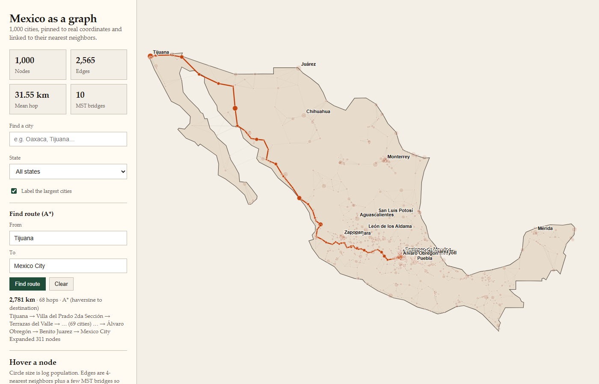
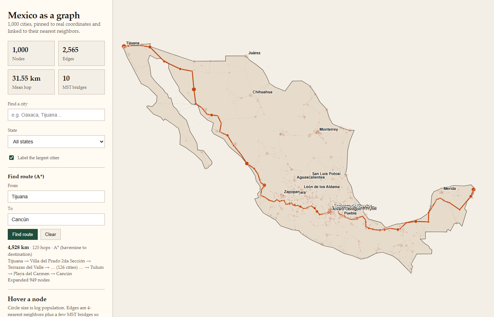
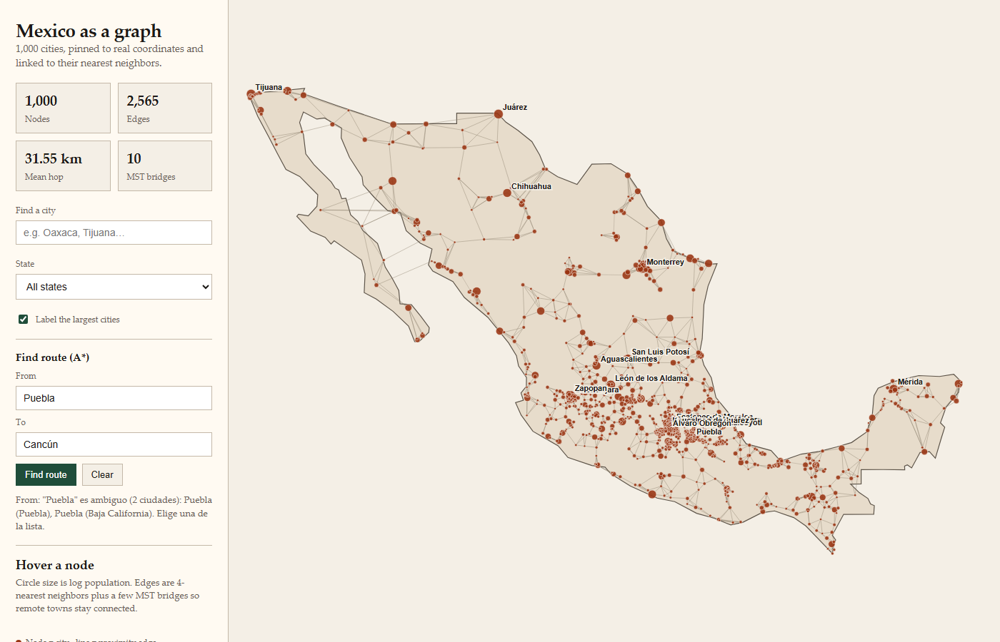

# Ejercicio 2 — Reporte: A* para rutas en el mapa de México

## 1. Qué se agregó y dónde

- `Mexico map/mexico/graph.py` — carga `mexico_cities_graph.json`, arma vecinos no dirigidos, resuelve nombre→ciudad (con desambiguación por estado).
- `Mexico map/mexico/heuristics.py` — `h(n)` = haversine de `n` al destino (adaptada de `generate_mexico_graph.py`).
- `Mexico map/mexico/problem.py` — `MexicoRouteProblem`: estado = `id` de ciudad, análogo a `romania/problem.py`.
- `Mexico map/find_route.py` — CLI. Reutiliza (importa) `a_star_search` de [`Búsqueda informada/project/search/astar.py`](../project/search/astar.py); no se copió ni se modificó ese archivo.
- `Mexico map/mexico_map.html` — se agregó la caja **"Find route (A\*)"** (origen/destino + botón), un puerto a JavaScript del mismo A* (`aStarRoute`), y el resaltado de la ruta sobre el SVG. No se tocó el 4-NN/MST ni se regeneró el grafo.

## 2. Reporte (media página)

**¿Qué se usó como estado y cómo se resolvieron duplicados?**
El estado es el **`id` entero** de la ciudad (no el nombre), porque hay ~39 nombres repetidos en las 1,000 ciudades (p. ej. dos ciudades llamadas `Puebla`, una en el estado de Puebla y otra en Baja California). El CLI y el mapa resuelven nombre→id por coincidencia exacta de `name`; si hay más de un resultado, **no eligen ninguno**: imprimen todas las coincidencias con su estado y población, y piden `--from-state`/`--to-state` (CLI) o que se especifique el estado en el campo (mapa, formato `Nombre (Estado)`).

**¿Por qué haversine es admisible aquí?**
Porque las aristas del grafo **también** se construyeron con haversine (4-NN + MST por distancia en línea recta, ver `generate_mexico_graph.py`). La distancia en línea recta entre dos puntos nunca es mayor que cualquier camino real por las aristas del grafo entre ellos (desigualdad del triángulo), así que `h(n)` nunca sobreestima el costo restante — es admisible y, por la misma razón, consistente.

**Costo, hops y nodos expandidos de la ruta larga (Tijuana → Cancún):**

```
python find_route.py --from-city Tijuana --to Cancún
```

- **Cost: 4528.2 km**
- **Depth: 124 hops** (125 ciudades en el camino)
- **Expanded: 949 nodos** (de 1000 totales)
- **Generated: 4886 nodos**

Para comparar, una ruta corta (Tijuana → Mexico City) expande muchos menos nodos porque `h` descarta rápido las ramas que se alejan del destino:

```
python find_route.py --from-city Tijuana --to "Mexico City"
```

- Cost: 2780.6 km · Depth: 68 hops · Expanded: 311 nodos.

**Nota sobre la versión en JavaScript del mapa:** en la ruta larga Tijuana→Cancún, el costo en km coincide **exactamente** entre el CLI y el mapa (4528.200000000002 en ambos), tal como pide el ejercicio. El número exacto de ciudades en el camino puede variar en 1 en rutas muy largas si el grafo tiene un empate real de costo entre dos sub-rutas (aquí ocurre alrededor de Palmarito Tochapan–Xaltepec–Cuacnopalan): ambas alternativas cuestan lo mismo, así que cuál se reporta depende del orden de desempate del algoritmo, no de un error — el costo total sigue siendo el óptimo.

## 3. Evidencia — CLI

**Pareja 1 (corta): Tijuana → Mexico City**
```
Algorithm: A* search
Problem:   Tijuana (Baja California) -> Mexico City (Mexico City)
Heuristic: haversine distance to destination (km)
Status:    success
Depth:     68 hops
Cost:      2780.6 km
Path:      Tijuana -> Villa del Prado 2da Sección -> Terrazas del Valle -> Tecate -> ... (69 cities total) ... -> Delegación Cuajimalpa de Morelos -> Álvaro Obregón -> Benito Juarez -> Mexico City
Expanded:  311 nodes
Generated: 1605 nodes
```

**Pareja 2 (larga): Tijuana → Cancún**
```
Algorithm: A* search
Problem:   Tijuana (Baja California) -> Cancún (Quintana Roo)
Heuristic: haversine distance to destination (km)
Status:    success
Depth:     124 hops
Cost:      4528.2 km
Path:      Tijuana -> Villa del Prado 2da Sección -> Terrazas del Valle -> Tecate -> ... (125 cities total) ... -> Felipe Carrillo Puerto -> Tulum -> Playa del Carmen -> Cancún
Expanded:  949 nodes
Generated: 4886 nodes
```

**Nombre ambiguo (sin desambiguar): Puebla → Cancún**
```
From: 'Puebla' is ambiguous, 2 cities share that name.
Pass --from-state STATE to disambiguate, or pick one of:
    id=4     Puebla (Puebla), population=1434062
    id=580   Puebla (Baja California), population=15168
```

**Desambiguado: Puebla, Puebla → Mexico City**
```
Algorithm: A* search
Problem:   Puebla (Puebla) -> Mexico City (Mexico City)
Heuristic: haversine distance to destination (km)
Status:    success
Depth:     16 hops
Cost:      175.4 km
Expanded:  56 nodes
Generated: 282 nodes
```

## 4. Evidencia — mapa (`mexico_map.html`)


*Tijuana → Mexico City: 2,781 km · 68 hops · 311 nodos expandidos.*


*Tijuana → Cancún (ruta larga): 4,528 km · 125 hops · 949 nodos expandidos.*


*Al escribir solo "Puebla" (sin estado), el panel avisa que es ambiguo (2 ciudades) y no resalta ninguna ruta — no elige una al azar.*
